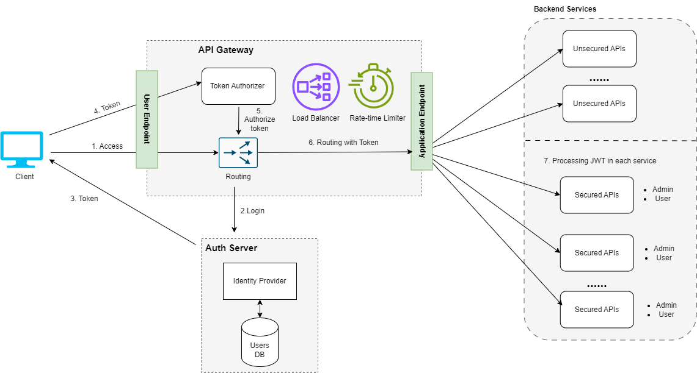
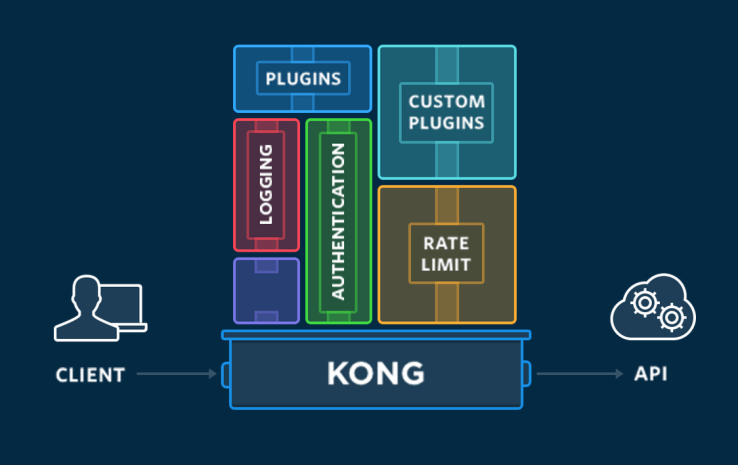
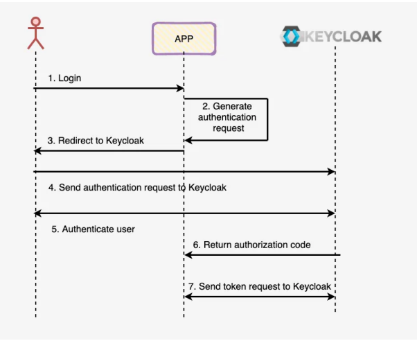
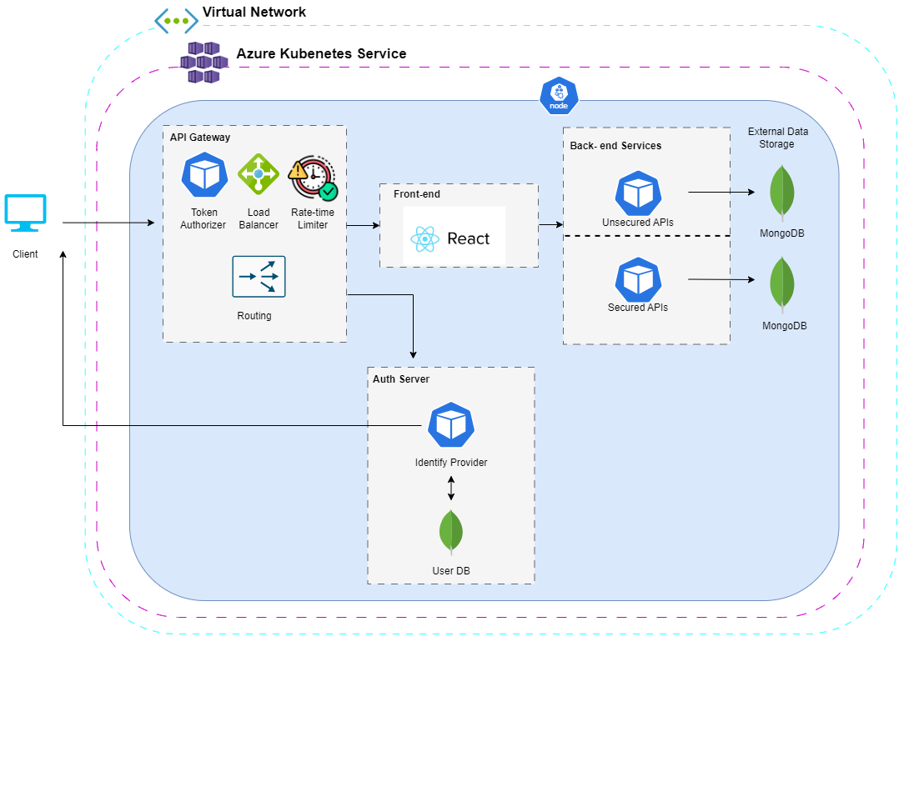

# DESIGN AND IMPLEMENTATION OF OAUTH2 IN SECURE API-GATEWAY FOR MICROSERVICE-BASED WEB APPLICATION
## Overview
We propose the adoption of the OAuth 2.0 standard as a methodology to safeguard these API endpoints. The use of OAuth 2.0 provides a robust framework for addressing the complexities associated with user authentication and authorization, ensuring secure and controlled access to the backend services. With the ever-growing complexity of interconnected microservices, OAuth 2.0 emerges as a strategic choice to enhance the protection of these critical components within the system, promoting a secure and efficient environment for user interactions with the backend servicesWe will focus on aspects such as authentication and authorization, securing data in transit, API key management, security testing, and event monitoring, aiming to build a robust and secure microservices system. This way, we can leverage the benefits of the microservices architecture while ensuring that this flexibility does not equate to vulnerability in terms of security.
## Proposed scheme

## KongGateway

## KeyCloak - Auth Server

## Deploy

## References
Hossain, N., Hossain, M. A., Hossain, M. Z., Sohag, M. H. I., & Rahman, S. (2018). Oauthsso: A framework to secure the oauth-based sso service for packaged web applications.
2018 17th IEEE International Conference On Trust, Security And Privacy In Computing And Communications/ 12th IEEE International Conference On Big Data Science And Engineering (TrustCom/BigDataSE), 1575–1578. https://doi.org/10.1109/TrustCom/BigDataSE.2018.00227
Kretarta, A. B., & Kabetta, H. (2022). Secure user management gateway for microservices architecture apis using keycloak on xyz. 2022 5th International Seminar on Research of Information Technology and Intelligent Systems (ISRITI), 7–13. https://doi.org/10.1109/ISRITI56927.2022.10052901

